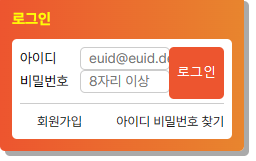

## Mission-02

- [General info](#general-info)
- [Results](#results)
- [Description](#description)

## General info

로그인 구현 과제

## Results

1. 로그인



## Description

```
html
└── head
    ├── meta
    ├── meta
    ├── meta
    ├── title
    ├── link
    └── link
└── body
    └── div.login
        ├── h1.login-title
        └── div.login-wrapper
            └── div.login-group
                └── form
                    └── fieldset
                        ├── legend
                        ├── div.login-form
                        │   ├── label.login-label
                        │   └── input.login-input
                        └── button.login-btn
            └── ul.link
                ├── li
                │   └── a
                └── li
                    └── a
```
```
조건
1. 일부 요소의 배치를 position 속성을 활용하여 구현
2. 회원가입, 아이디, 비밀번호 찾기은 float을 활용하여 구현
```

```
로그인 버튼을 position을 이용하여 구현
login-group에 position relative를 적용시켜 .login-btn이 login-group을 기준으로 위치를 잡도록 지정해주었습니다
.login-group {
  position: relative;
}
.login-btn {
  position: absolute;
  top: 0;
  right: 0;
}

회원가입, 아이디/비밀번호 찾기을 float을 이용하여 구현
첫번째 요소에는 float을 이용하여 좌측으로 위치 지정해주었고
두번째 요소에는 float을 이용하여 우측으로 위치 지정해주었습니다.

.link li:first-child {
  float: left;
}
.link li:last-child {
  float: right;
}
```