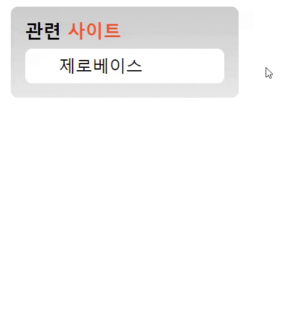

## Mission-03

- [General info](#general-info)
- [Results](#results)
- [Description](#description)

## General info

transition을 활용하여 관련 리스트 구현

2023-06-09 ~ 2023-06-11

## Results

1. 관련 리스트 구현




## Description

```
html
└── head
    ├── meta (charset="UTF-8")
    ├── meta (name="viewport")
    ├── title
    ├── link (rel="stylesheet")
    └── link (rel="stylesheet")
└── body
    └── section (class="related-site")
        ├── h1 (class="related-title")
        │   └── span (class="site")
        └── ul (class="related-list", aria-label="관련 사이트 리스트")
            ├── li
            │   └── a (href="/")
            ├── li
            │   └── a (href="/")
            ├── li
            │   └── a (href="/")
            ├── li
            │   └── a (href="/")
            └── li
                └── a (href="/")
```

CSS 조건

- transition 실습을 위한 과제 파일은 mission-03/transition.html 파일과 mission-03/transition.css 파일을 생성 후 각각 마크업과 스타일을 작성한다
- 관련 사이트는 제목으로 각각 항목은 링크로 구현한다.
- 링크 목록은 5개이며 CSS를 사용하여 화면에 1개의 목록만 보이도록 구현한다.
- 목록에 마우스를 올리면 5개의 목록이 펼쳐지도록 구현한다.
- transition 속성을 활용하여 애니메이션 효과를 적용한다.

```
.related-list에 transition 속성을 부여하여 요소의 높이와 패딩이 0.3초 동안 변경되도록 설정해 주었다

.related-list {
    transition: height 0.3s, padding 0.3s 0.3s;
}
```

```
.related-list:hovor,.related-list:focus에 마우스 커서를 관련 목록 위로 
가져가거나 해당 목록에 포커스를 맞추면 관련 목록의 높이가 147픽셀로 조정되고 
패딩이 10픽셀로 설정되도록 지정해 주었다

.related-list:hover,
.related-list:focus{
    height: 147px;
    padding: 10px 0;
}
```
