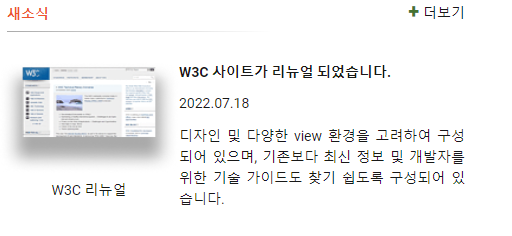

## Mission-04

- [General info](#general-info)
- [Results](#results)
- [Description](#description)

## General info

grid을 활용하여 새소식 구현

2023-06-12 ~ 2023-06-14

## Results

1. 새소식 구현




## Description

```
html
└── head
    ├── meta (charset="UTF-8")
    ├── meta (name="viewport")
    ├── title
    └── link (rel="stylesheet")
└── body
    └── section (class="news")
        ├── h2 (class="news-title")
        └── div (class="news-board")
            ├── h3 (class="news-highlight")
            ├── p (class="news-time")
            ├── p (class="news-detail")
            ├── figure (class="news-img")
            │   ├── img (src="./news.png", alt="W3C 리뉴얼 페이지")
            │   └── figcaption
            └── a (href="/", class="news-link", target="_blank", rel="noopener noreferrer")
                └── span
```

CSS 조건

- 각각 마크업과 스타일을 작성한다.
- 더보기 링크 앞에 플러스 기호는 생략해도 무방하다.
- 이미지는 “W3C 리뉴얼”이라는 캡션 위에 썸네일 이미지를 사용한다.
(해당 이미지는 배경으로 지정하지 말고  요소를 사용하여 콘텐츠 이미지로 배치)
- grid를 활용하여 레이아웃을 구현한다.

```
그리드 레이아웃은 12개의 열과 1개의 행으로 구성했습니다. 첫 번째 열은 img title 영역을 
차지하고 두 번째 열은 img date 영역을 차지하고 세 번째 열은 img detail영역을 차지하도록 
지정해 주었습니다. 그리드의 행을 생성해 행의 너비는 자동으로 계산하도록 auto로 지정해 
주었습니다. 

.news-board {
 display: grid;
 grid-template-columns: repeat(12,1fr);
    grid-template-rows: auto;
    grid-template-areas: 
    "img title"
    "img date"
    "img detail";
}
```

```
figure class="news-img">
    
    <figcaption>W3C 리뉴얼</figcaption>
</figure>
```