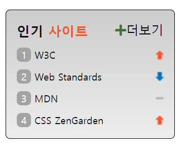

## Mission-05

- [General info](#general-info)
- [Results](#results)
- [Description](#description)

## General info

sprite을 활용하여 인기 사이트 랭크 구현

2023-06-14 ~ 2023-06-16

## Results

1. 인기 사이트 랭크 구현




## Description

```
html
├── head
│   ├── meta
│   ├── meta
│   ├── title
│   ├── link
│   └── link
└── body
    └── section.popular__site
        ├── h2.site__title
        │   ├── 인기
        │   └── span.accentsite
        │       └── 사이트
        ├── ol.site__list
        │   ├── li.list__item.sprite.sprite-up
        │   │   └── a.list__link
        │   ├── li.list__item.sprite.sprite-down
        │   │   └── a.list__link
        │   ├── li.list__item.sprite.sprite-no
        │   │   └── a.list__link
        │   └── li.list__item.sprite.sprite-up
        │       └── a.list__link
        └── a.site__more
            ├── span.fas.fa-plus
            └── 더보기
```
```
과제 조건
- sprite 실습을 위한 과제 파일은 mission-05/sprite.html 파일과 mission-05/sprite.css
 파일을 생성 후 각각 마크업과 스타일을 작성한다.
- 더보기 링크 앞에 플러스 기호는 생략해도 무방하다.
- rank.png(webcafe-RWD/assets 폴더에 있음) 이미지를 활용하여 스프라이트 기법으로 
스타일링 한다.
- 각 인기 사이트의 순위를 나타내는 영역은 기존 <ol> 요소에서 제공하는 기본 숫자를 보이지
 않도록 한 후 CSS로 구현한다.
- mission-05/README.md 파일을 생성한 후 마크업 코드와 CSS 코드에 대한 설명을 적고 아래
 이미지와 같이 완성된 UI 스크린샷을 삽입한다.
 ```

 ```
ol 요소에서 제공하는 기본 숫자를 보이지 않도록 구현하기 위해 count-reset과 list-style을 
사용하여 숫자 없는 목록을 만들었습니다. 그 후 counter-increment속성과 content 속성을 
사용하여 카운터 값을 증가시키고, 해당 값을 항목의 앞에 표시 되도록 하였습니다
.site__list {
    counter-reset: ranking;
    list-style: none;
}
.list__item {
    counter-increment: ranking;
}
.list__item::before {
    content: counter(ranking);
}
```

```
이미지를 활용하여 스프라이트 기법으로 스타일링 하는 조건을 달성하기 위해 background로 
이미지를 호출하여 no-repeat 100% 0 을 줘서 이미지를 반복하지 않고 요소의 오른쪽 상단에 
배치하도록 성정하였습니다
.sprite {
    background: url(./rank.png) no-repeat 100% 0;
}

랭크가 올라가는 이미지를 sprite-up 클래스 선택자로 줘서 background-position-y로 3px 
위로 이동하였고 sprite-down은 background-position-y로 -42px 로 설정하여 아래로 42픽셀 
이동하게 하였고 sprite-no는 background-position-y로 -19px 위로 이동시켰습니다.
.sprite-up {
    background-position-y: 3px;
}
.sprite-down {
    background-position-y: -42px;
}
.sprite-no {
    background-position-y: -19px;
}
```